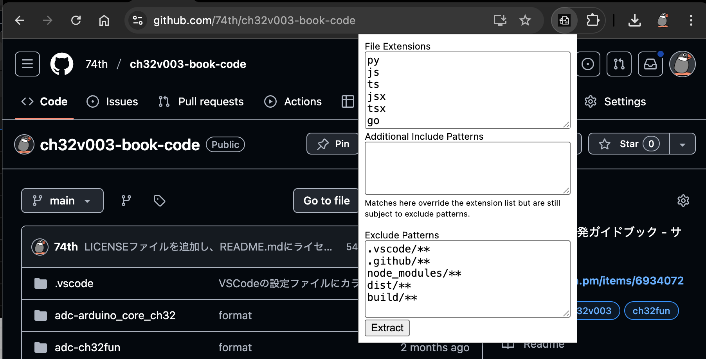

# GitHub Repo Single Text Exporter



This Chrome extension downloads the current GitHub repository as a ZIP file, extracts text-based files, and combines them into a single file. By default common programming languages are included such as `.py`, `.js`, `.ts`, `.jsx`, `.tsx`, `.go`, `.java`, `.c`, `.cpp`, `.cs`, `.rb`, `.rs`, `.php`, `.kt`, `.swift`, `.sh`, `.md`, and `.txt`. If a `README.md` file is present it is placed first at the repository root and at the start of any subdirectories, with all other files sorted alphabetically. The list of extensions can be customised from the extension's options page. The generated text begins with the repository's full name and description, followed by a tree view of all included files.

## Custom File Extensions

Use the Options page to specify which file extensions should be collected when exporting a repository. Enter one extension per line; if no value is provided the default list is used (`py`, `js`, `ts`, `jsx`, `tsx`, `go`, `java`, `c`, `cpp`, `cs`, `rb`, `rs`, `php`, `kt`, `swift`, `sh`, `md`, `txt`).

### Exclude Files

The Options page also lets you specify glob patterns for files to omit from the export. By default `.vscode/**`, `.github/**`, `node_modules/**`, `dist/**`, and `build/**` are excluded. Enter one pattern per line using [minimatch](https://github.com/isaacs/minimatch) syntax to customise the list.
You can also configure the maximum size of each output file in megabytes. The default is 3MB.
Paths are matched relative to the repository root and the `file:` sections in the
output use these same relative paths.

### Repository Include Patterns

From the popup you can define extra glob patterns for files to include on a
per-repository basis. Files that match these patterns are collected even if their
extensions are not listed above. Exclude patterns still take precedence.

Click the extension icon while viewing a GitHub repository to download the text file. The repository archive is fetched from the branch shown in the URL if one is present, otherwise the repository's default branch is used. Branch names containing slashes are detected correctly. The download URL is logged to the extension's service worker console.

## Private Repositories

To access private repositories the extension requires a GitHub Personal Access Token (PAT) with at least the `repo` scope.
When the extension is first used it will prompt for a token, which is stored locally using Chrome storage. The token is
sent in the `Authorization` header when downloading the repository archive.

## Download

https://github.com/74th/github-repo-to-single-txt-chrome-extension/releases

## Building

The source is written in TypeScript and bundled with [esbuild](https://esbuild.github.io/). Run the following commands to build and package the extension:

```bash
npm install
npm run package
```

`npm run package` creates `github-repo-to-single-txt-extension.zip` containing the compiled background script and `manifest.json`. Load this ZIP (after extracting) as an unpacked extension in Chrome. You can also download this pre-built ZIP from the repository's Releases page.
